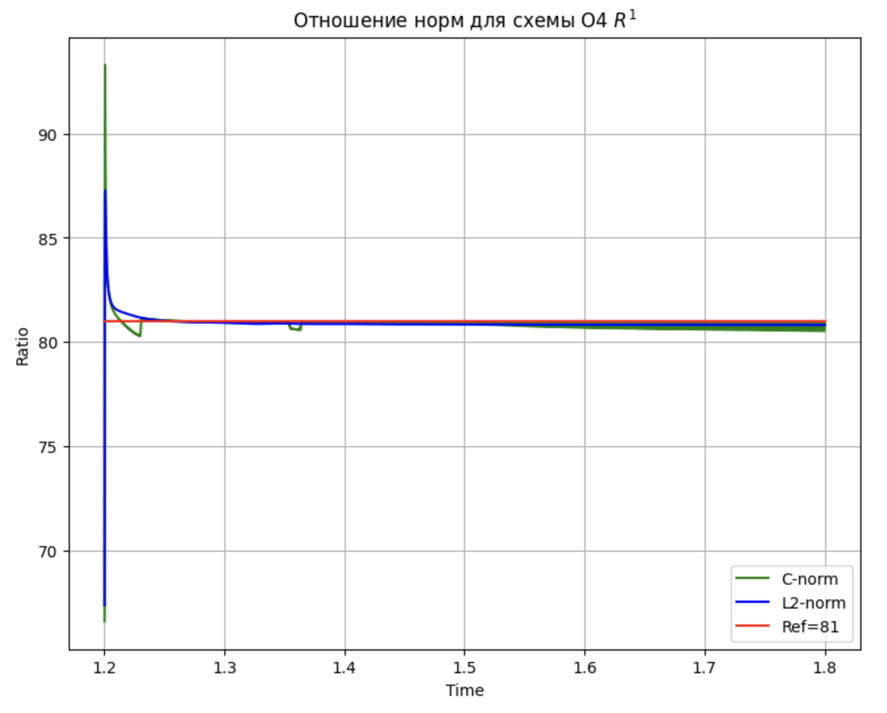

# Отношение норм для схемы O4

pdf:  [fourth task](https://github.com/alex2211-put/Modeling-of-waves-in-elastic-media/blob/main/fifth/putin_m_5.pdf)

ipynb: [fourth task](https://github.com/alex2211-put/Modeling-of-waves-in-elastic-media/blob/main/fifth/putin5.ipynb)
