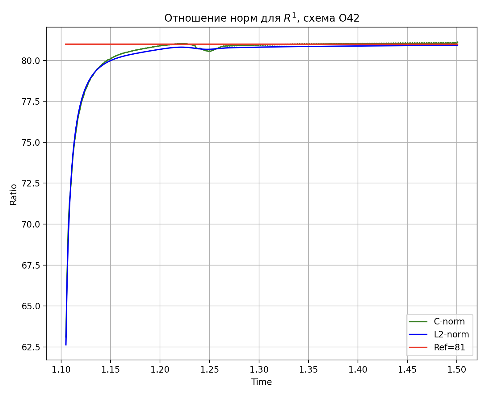
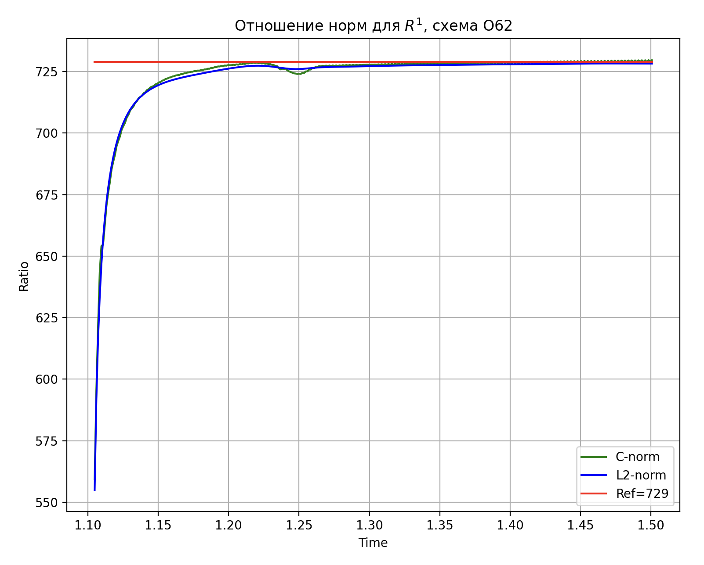

# Отношение норм для схемы O42

# Отношение норм для схемы O62

pdf:  [fourth task](https://github.com/alex2211-put/Modeling-of-waves-in-elastic-media/blob/main/fourth/putin_m_4.pdf)

ipynb: [fourth task](https://github.com/alex2211-put/Modeling-of-waves-in-elastic-media/blob/main/fourth/putin4.ipynb)
