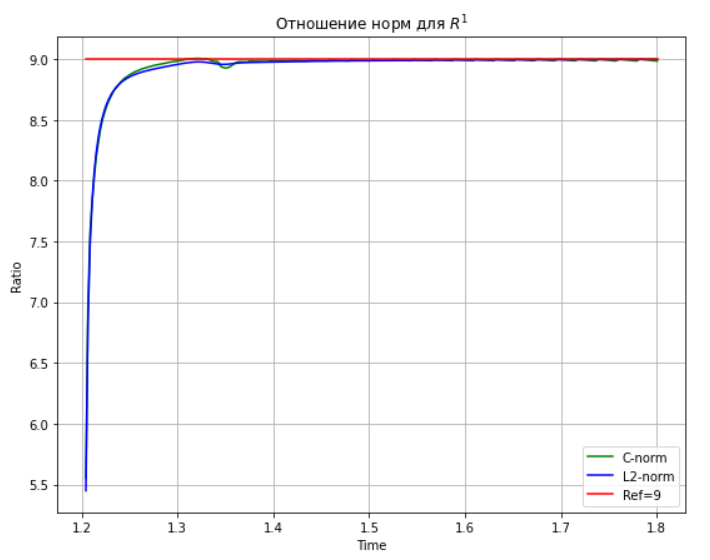
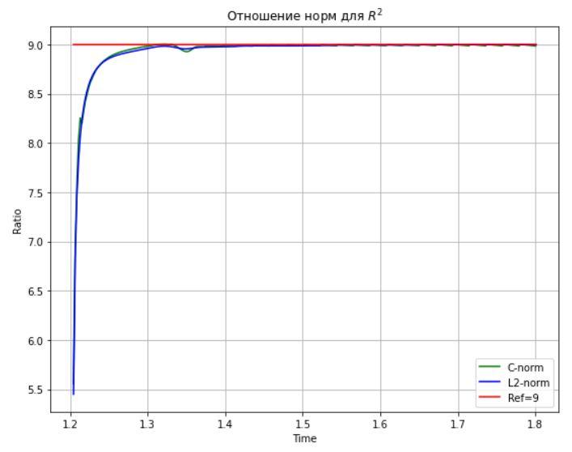
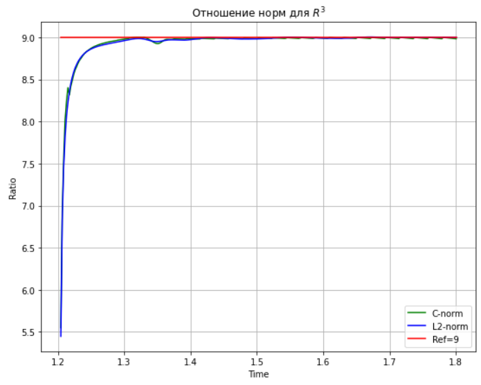

# Отношение норм для R1

# Отношение норм для R2

# Отношение норм для R3

pdf:  [third task](https://github.com/alex2211-put/Modeling-of-waves-in-elastic-media/blob/main/third/putin_m_3.pdf)

ipynb: [third task](https://github.com/alex2211-put/Modeling-of-waves-in-elastic-media/blob/main/third/putin3.ipynb)
